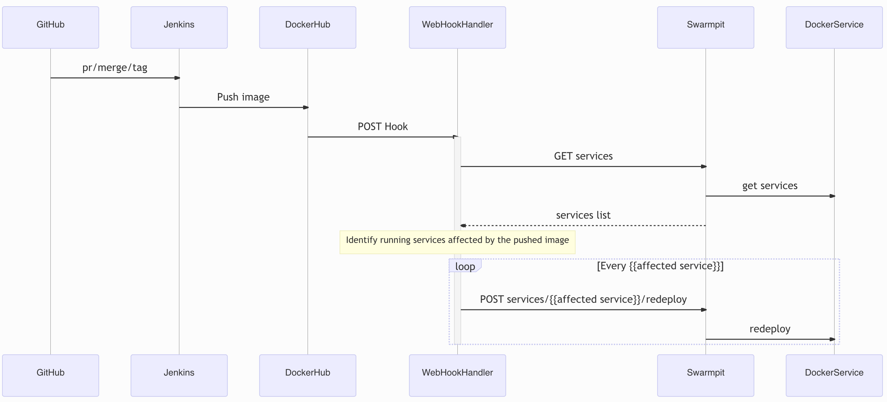
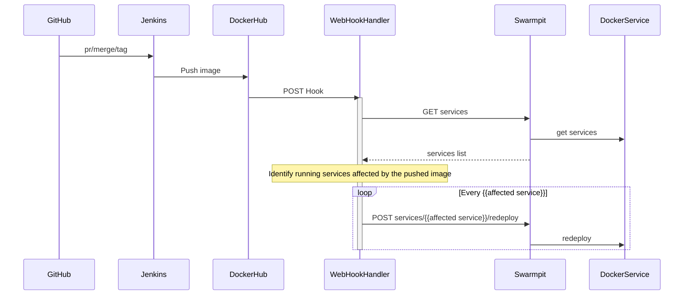
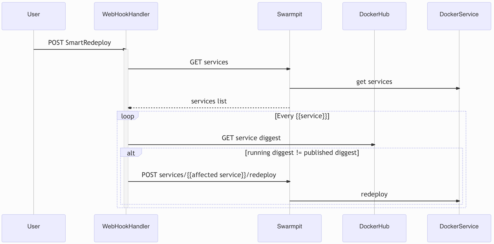
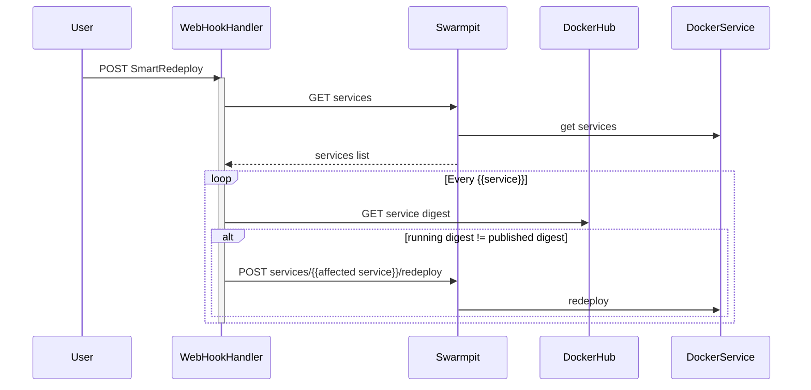

# doppler-cd-helper

We were basing our CD on:

- Generating images with semantic version tagging
- Swarmpit auto-redeploy feature

But, it is expensive due Swarmpit checks DockerHub each minute for each image.

So, we want to do the same work attending Docker Hub web-hooks and, depending on the updated image and running services, take the right action:

Then, as a next step, we could support a complete validation and update of obsolete services:

For the moment, for simplicity, we will base it on Swarmpit API, but in the future, we could work directly against docker daemon.

## Conventions / development processes / CI / CD

See more information about these topics in

- [Hello-Microservice repository](https://github.com/FromDoppler/hello-microservice/blob/main/README.md)

- [Doppler-Forms repository](https://github.com/MakingSense/doppler-forms/blob/master/README.md#continuous-deployment-to-test-and-production-environments)

- [Doppler-Swarm repository](https://github.com/MakingSense/doppler-swarm/blob/master/README.md)

### Run validations in local environment

The source of truth related to the build process is [.doppler-ci](./.doppler-ci) (a symlink to [Jenkisfile](./Jenkinsfile)). It basically runs docker build, so, you can reproduce jenkins' build process running `docker build .` or `sh ./verify-w-docker.sh`.

If you prefer to run these commands without docker, you can read [Dockerfile](./Dockerfile) and follow the steps manually.
